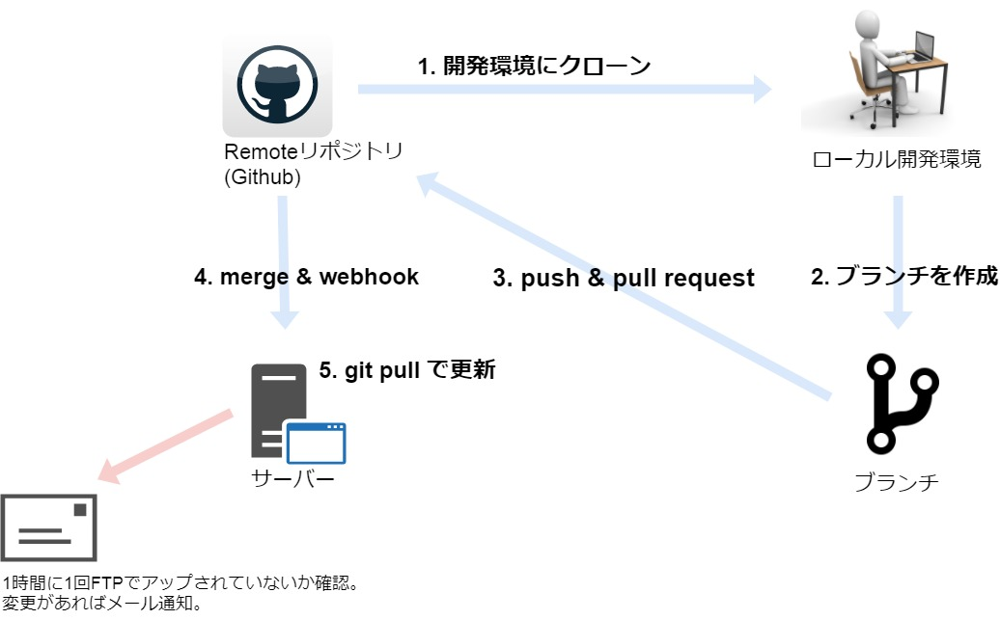
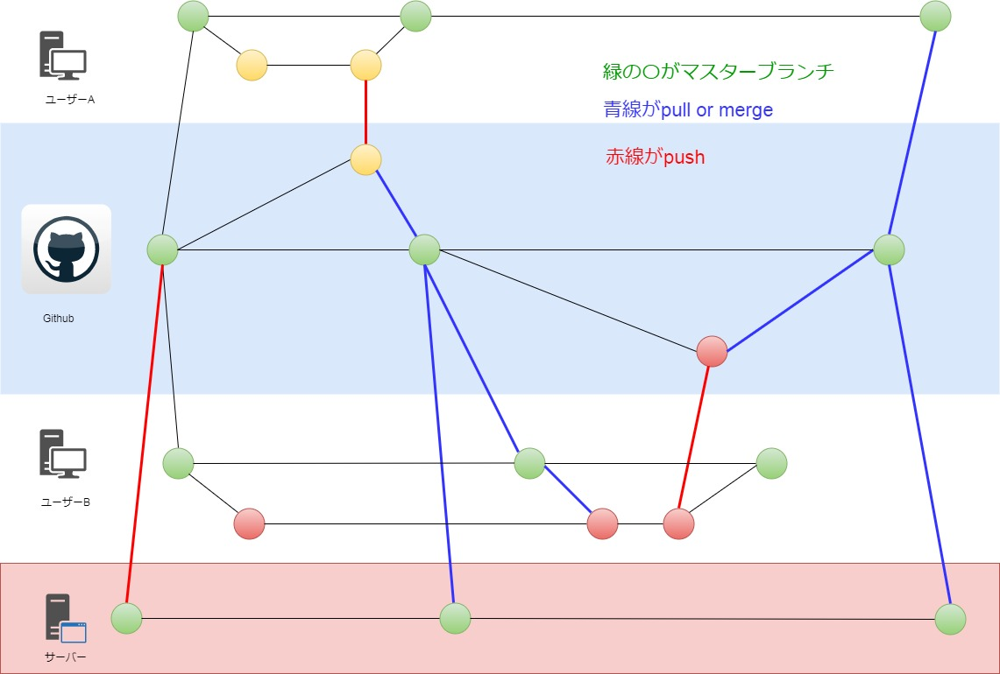

アイプリモ/ラザールのGithub化
===

企画制作部 
那須 毅康

---

## Agenda

1. 前回のおさらい
2. 構成
3. 今後の課題

---

## 1.前回のおさらい

---

### Githubを導入することで何ができる?

- ファイルの更新履歴を管理
- 簡単に差分確認
- 誰が何の目的で変更したのかの記録も残せる
- 自分が編集したファイルのみ自動で更新
- 差分を取り込むまで上書きできない
- 差分ファイルのみ自動で取りこむ

---

## その結果

- **他の作業者に影響を与えずに、 自分の作業分を進めることができます**
- **お互いの考えている経過が 見えるようになります**
- **実物をみながら議論できます**

---

<h2 class="fc_white">今回さらに...<i class="em em-thinking_face"></i></h2>

---

<h3>Github上とサーバー上のファイルが自動同期<i class="em em-congratulations"></i></h3>

例えばサーバー上のファイルとバックアップファイルに差分がある場合、どちらが正しいファイルかわからなくなる場合があります。それによりバックアップがバックアップとして機能しなくなる状態になりかねません。  
ファイルが自動的に同期されれば上記の問題を防ぐことができます。

---

<h3>Web上でデプロイ可能<i class="em em-tada"></i></h3>

Githubのサイト上からボタンを押すだけでサイトを更新できます。
FTPでファイルをアップロードする必要はありません。なので、ファイルのあげ忘れや、間違ったファイルをアップすることもなくなります。

---

## 3. 構成

---

---

---

## 4. 今後の課題

---

- やらかしたときの対応の練習が足りない
- UIが英語
  - [GitHub、日本語Webサイトを3月に公開へ \| CoRRiENTE\.top](https://corriente.top/github-japan-website-release/)

---

# ありがとうございました
